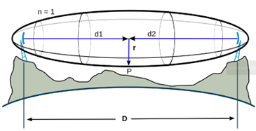
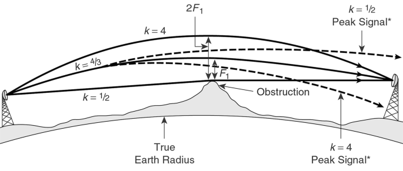
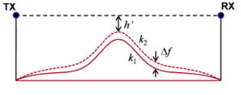

# Radio Link simulator
This repository is a radio frequency (RF) link simulator built in **Python 🐍**. By inputting a set of parameters and the topographic profile between two endpoints, the simulator calculates a point-to-point link between these sites. Additionally, it determines the minimum height required for the antennas at both ends for the link to be established, as well as the reception power.

## Installation
Use the package management system [pip](https://pip.pypa.io/en/stable/) to install the simulator dependencies:
```bash
pip install -r requirements.txt
```

## Virtual Environment
To ensure compatibility with the required dependencies, it is recommended to use a virtual environment:
```bash
python -m venv myenv
source myenv/bin/activate  # On macOS/Linux
myenv\Scripts\activate  # On Windows
```

## Usage
### File Upload
To load the topographic profile, you must provide a file containing the latitude and longitude of each point between the two endpoints, along with the altitude (in meters) of those points.
Example cases can be found in the repository, such as [Mina](./Scripts/Assets/Mina.txt) and [Panaholma](./Scripts/Assets/PtoPto%20Panaholma.txt).
### Configuration Parameters
- Fresnel Radius (n): Represents the number of zones that must remain clear (by a certain percentage of their radius) to avoid destructive interference that could reduce signal power or cause phase cancellation due to environmental effects such as absorption, attenuation, diffraction, interference, refraction, and reflection.
The Fresnel zones can be visualized as several 3D ellipses that maintain the same distance between antennas d1 and d2, with each having an increasingly larger radius.



The radius of the nth Fresnel zone is calculated as:
$$r_n = \sqrt{{d_1 \cdot d_2 \cdot \lambda \cdot n} \over {d_1 + d_2} }$$
Where:
  - $r_n$: radius of the nth Fresnel zone
  - $d_1 [m]$: distance between the transmitter and the center of the ellipsoid
  - $d_2 [m]$: distance between the receiver and the center of the ellipsoid
  - $\lambda [m]$: wavelength of the transmitted signal
- Lambda (mm): Wavelength of the transmitted signal, expressed in millimeters.
- Percentage of the Radius (%): The percentage of the nth Fresnel radius that must remain clear.
- Correction Factor K: Adjusts obstacle height due to Earth's curvature and atmospheric conditions, following the Effective Earth Radius Model. The standard value is *k=4/3*.



This adjustment modifies the Earth's radius, affecting obstacle height, as calculated by:
$$f = {d_1 \cdot d_2 \over 2\cdot k \cdot r_t}$$
Where:
  - $f [m]$: real obstacle height correction
  - $d_1 [m]$: distance from the transmitter to the obstacle
  - $d_2 [m]$: distance from the receiver to the obstacle
  - $k$: correction factor
  - $r_t [m]$: Earth's radius




  Using the correction factor $f$, the apparent obstacle height is:
$$h_a = h_r + f$$
Where:
  - $h_a [m]$: apparent height of the obstacle
  - $h_r [m]$: real height of the obstacle
  - $f [m]$: correction factor
- Antenna Gain [dBi]: Increase in received power in the antenna's maximum radiation direction relative to an isotropic antenna:
$$G = 10\cdot log[4\pi {U(max) \over P(in)} ]$$
Where:
  - G [dBi]: antenna gain
  - U(max) [dBm]: radiation intensity of the antenna in the maximum direction
  - P(in) [dBm]: input power to the antenna
- EIRP: Transmitted power by the antenna:
$$EIRP = P_t - A_c + G_a$$
Where:
  - $P_t [dBm]$: transmitted power
  - $A_c [dB]$: cable attenuation
  - $G_a [dBi]$: antenna gain
### Link Calculation
From the calculation of the distance between the link's endpoints (and each of the intermediate points), the upper and lower Fresnel radii (with their respective inclinations), and the apparent height of obstacles, the required antenna height is determined to ensure that no obstacle surpasses the line-of-sight of the point-to-point link, along with the required clearance percentage of the lower Fresnel radius:
$$ h_A = r_i + (r_l - r_i) \cdot \left( 1 - \frac{p_r}{100} \right) $$

Where:
  - $h_A [m]$: antenna height
  - $r_i [m]$: lower Fresnel radius
  - $r_l [m]$: line of sight
  - $p_r$: percentage of the free radius

Finally, the reception power of the link is calculated as follows:
$$P_r = EIRP - 20 \cdot log({4 \pi d \over \lambda}) + G_r$$
Where:
  - $P_r [dBm]$: received power
  - $EIRP [dBm]$: transmitted power by the antenna
  - $d [m]$: distance between endpoints
  - $\lambda [m]$: wavelength of the signal
  - $G_r [dBi]$: receiver antenna gain

> 🌎 This documentation is available in **English**.  
> For the Spanish version, check [README_es.md](./README_es.md).  