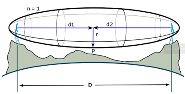
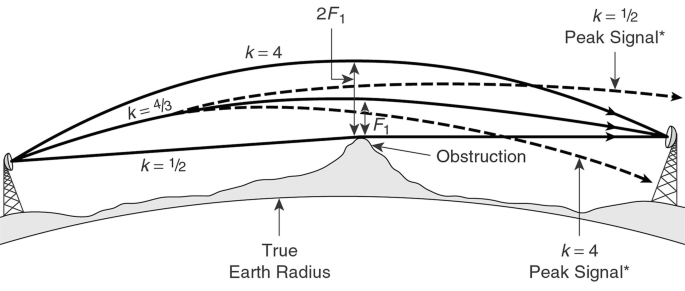
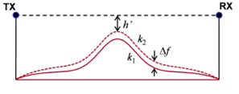

# Simulador de radio enlace
El presente repositorio es un simulador de enlaces de radiofrecuencia o RF hecho en **Python** 🐍. A través del ingreso de un conjunto de parámetros y el perfil topográfico entre dos extremos, se simula un enlace punto a punto entre dichos sitios. Adicionalmente, se calcula la altura mínima que deben tener las antenas en ambos extremos para que el enlace pueda ser construido, como a su vez la potencia de recepción.

## Instalación
Usar el sistema de gestión de paquetes [pip](https://pip.pypa.io/en/stable/) para instalar las dependencias del simulador:
```bash
pip install -r requirements.txt
```

## Entorno Virtual
Para asegurarse compatibilidad con las dependencias requerdias, se recomienda utilizar un entorno virtual:
```bash
python -m venv myenv
source myenv/bin/activate  # Para macOS/Linux
myenv\Scripts\activate  # Para Windows
```

## Utilización
### Carga de archivo
Para cargar el perfil topográfico, se debe cargar un archivo el cual contenga la latitud y longitud de cada uno de los puntos entre ambos extremos, junto con la altitud (expresada en metros) de dichos puntos.
En el repositorio se pueden observar a modo de ejemplo los casos [Mina](./Scripts/Assets/Mina.txt) y [Panaholma](./Scripts/Assets/PtoPto%20Panaholma.txt).
### Parámetros de configuración
- Radio de Fresnel (n): es el número de zonas que se deben considerar libres (en un determinado porcentaje de su radio) para evitar una interferencia destructiva que cause una reducción de la potencia de la señal o cancelación por fase, debido a los fenómenos del medio como absorción atenuación, difracción, interferencia, refracción y reflexión.
Es posible imaginar las zonas de fresnel como varias elipises en 3D, las cuales tienen la misma distancia entre las antenas d1 y d2, para cada una dispone de un radio r cada vez mayor.



A partir de este valor, el radio de la n-esima zona de Fresnel se calcula como:
$$r_n = \sqrt{{d_1 \cdot d_2 \cdot \lambda \cdot n} \over {d_1 + d_2} }$$
Donde:
  - $r_n$: radio de la n-eseima zona de Fresnel
  - $d_1 [m]$: distancia entre el transmisor y el centro del elipsoide
  - $d_2 [m]$: distancia entre el receptor y el centro del elipsoide
  - $\lambda [m]$: longitud de onda de la señal transmitida
- Lambda (mm): longitud de onda de la señal transmitida, expresada en mm.
- Porcentaje del radio (%): porcentaje del n-esimo radio de Fresnel que debe estar libre.
- Factor de corrección K: corrección de altura de los obstáculos, debido a la curvatura terrestre y las condiciones atomsféricas, de acuerdo con el modelo de Tierra Ficticia. El estándar es *k=4/3*.



Como resultado, se modifica el radio de la tierra, modificando así la altura de los obstáculos, de acuerdo con la siguiente expresión:
$$f = {d_1 \cdot d_2 \over 2\cdot k \cdot r_t}$$
Donde:
  - $f [m]$: corrección de altura real del obstáculo
  - $d_1 [m]$: distancia entre el transmisor y el obstáculo
  - $d_2 [m]$: distancia entre el receptor y el obstáculo
  - $k$: factor de corrección
  - $r_t [m]$: radio de la tierra




  Utilizando el factor de corrección $f$, obtenemos la altura aparente del obstáculo:
$$h_a = h_r + f$$
Donde:
  - $h_a [m]$: altura aparente del obstáculo
  - $h_r [m]$: altura real del obstáculo
  - $f [m]$: factor de corrección
- Ganancia de la antena [dBi]: incremento de la potencia recibida en dirección de máxima radiación de la antena, con respecto a una antena isotrópica:
$$G = 10\cdot log[4\pi {U(max) \over P(in)} ]$$
Donde:
  - G [dBi]: ganancia de la antena
  - U(max) [dBm]: intensidad de radiación de la antena en la dirección de máxima
  - P(in) [dBm]: potencia de entrada a la antena
- EIRP: potencia transmitida por la antena, siendo:
$$EIRP = P_t - A_c + G_a$$
Donde:
  - $P_t [dBm]$: potencia transmitida
  - $A_c [dB]$: atenuación del cable
  - $G_a [dBi]$: ganancia de la antena
### Cálculo de enlace
A partir del cálculo de la distancia entre los extremos del enlace (y cada uno de los puntos intermedios), los radios superior e inferior de Fresnel (con sus respectivas inclinaciones) y la altura aparente de los obstáculos, se calcula la altura que deben tener las antenas, de modo que ningún obstáculo pueda superar la línea de vista del enlace punto a punto, en conjunto con el porcentaje del radio inferior de Fresnel que debe permanecer visible:

$$ h_A = r_i + (r_l - r_i) \cdot (1 - p_r / 100) $$


Donde:
  - $h_A [m]$: altura de las antenas
  - $r_i [m]$: radio inferior de Fresnel
  - $r_l [m]$: linea de vista
  - $p_r$: porcentaje de radio libre

Finalmente, se calcula la potencia de recepción del enlace de la siguiente manera:
$$P_r = EIRP - 20 \cdot log({4 \pi d \over \lambda}) + G_r$$
Donde:
  - $P_r [dBm]$: potencia recibida
  - $EIRP [dBm]$: potencia transmitida por la antena
  - $d [m]$: distancia entre extremos
  - $\lambda [m]$: longitud de onda de la señal
  - $G_r [dBi]$: ganancia de la antena receptora